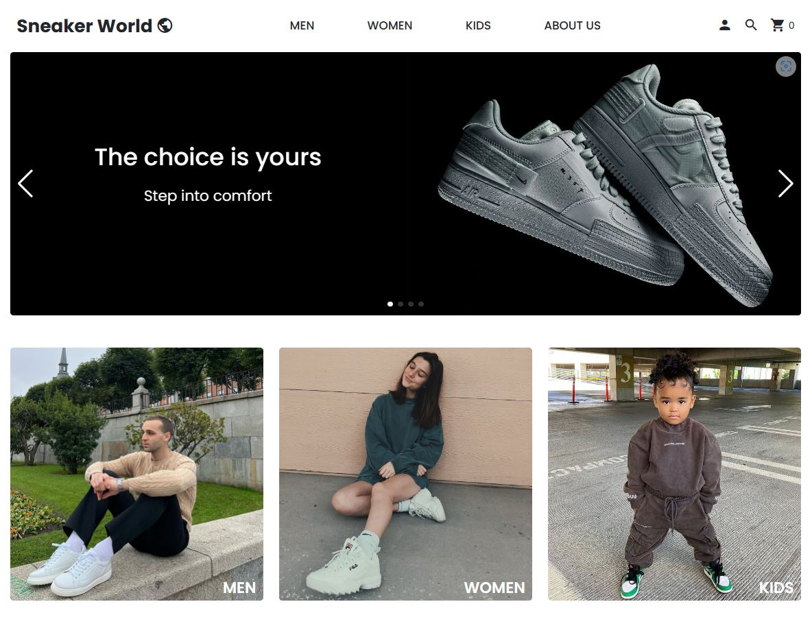

  

<h1 style="font-size: 48px;" align="center">Sneaker World </h1>

  <i>Step into comfort</i>
   
  <a href="https://sneaker-world.ru"><strong>Go to site</strong></a>

  
Table of Contents

- [About The Project](#about-the-project)
  - [Legend:](#legend)
  - [Real Story:](#real-story)
- [Built With](#built-with)
- [License](#license)
- [Contact](#contact)

## About The Project

### Legend:
"Sneaker World" is an online store that specializes in selling a wide range of sneakers. The store was founded by a group of passionate sneaker enthusiasts who wanted to create a platform where people could find the latest and most exclusive sneaker releases.

The founders of "Sneaker World" believed that there was a lack of reliable and trustworthy sources for sneaker enthusiasts to purchase their favorite sneakers. They wanted to create a store that would offer a wide selection of sneakers from various brands, as well as provide customers with a convenient and secure shopping experience.

Since its inception, "Sneaker World" has grown rapidly, attracting customers from all over the world. The store offers a wide range of sneakers from popular brands such as Nike, Adidas, and Puma, as well as limited edition and exclusive releases.

### Real Story:
"Sneaker World" is an e-commerce pet-project for developing skills in creating a web application. I hope you enjoyed it.

(<a href="#readme-top">back to top</a>)

## Built With

* 
* 
* 
* 
* 
* 
* 
* 
* 

(<a href="#readme-top">back to top</a>)

## License

(<a href="#readme-top">back to top</a>)

## Contact

Telegram: [Denis Kopylov](https://t.me/TimeToBeShine) - Python Developer

Project Link: [https://github.com/iamwebster/django-ecommerce](https://github.com/iamwebster/django-ecommerce)

(<a href="#readme-top">back to top</a>)

